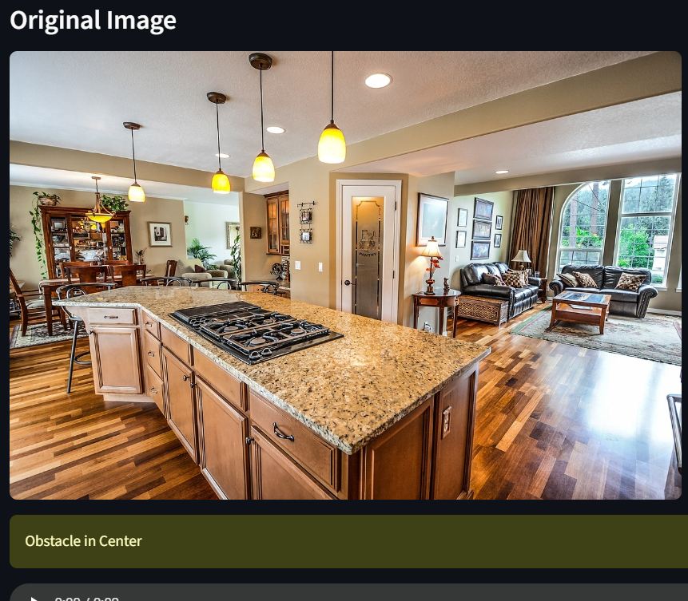
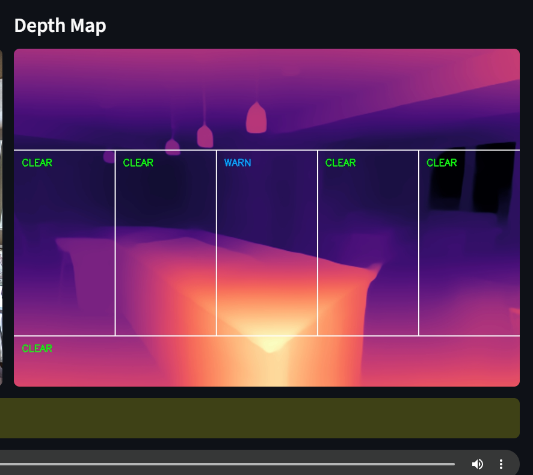

# Depth Vision — AI Obstacle Detection for the Visually Impaired

A Streamlit web app that estimates depth from a single uploaded photo using Intel's **MiDaS** model, splits the scene into spatial zones, flags potential obstacles, and reads the result aloud — built as an accessible, screen-free obstacle detection tool.

> Upload a photo → get a depth map, a zone-by-zone obstacle breakdown, and a spoken summary.

---

## Demo

| Original Image | Depth Map with Zones |
|---|---|
|  |  |

---

## Features

- **Monocular depth estimation** using Intel's pretrained MiDaS model (no training data or training pipeline required — see [MIDAS_RESEARCH.md](./MIDAS_RESEARCH.md) for how the model works internally)
- **5-zone spatial obstacle analysis** (far-left, left, center, right, far-right) plus a separate floor zone for steps/curbs
- **Relative, adaptive thresholding** — alert sensitivity scales to each photo automatically rather than using hardcoded values
- **Visual zone overlay** drawn directly on the depth map, color-coded by danger level (clear / warning / critical)
- **Audio output** via offline text-to-speech, so results can be consumed without reading the screen
- **Deployed as a Streamlit web app** — no local setup needed to try it

---

## Why This Project

This was built as an assistive-technology exploration following an earlier capstone project (*Blind Assist*, a Raspberry Pi-based wearable navigation device). This version reframes the same core idea — MiDaS-based obstacle detection — as a lightweight, photo-based web app to demonstrate the full pipeline: model inference, spatial reasoning, and accessible output, end to end.

---

## Project Structure

```
depth_vision_project/
│
├── app.py              # Streamlit frontend — UI, file upload, orchestration
├── depth_engine.py      # Loads MiDaS, runs inference on an uploaded image
├── zone_analyzer.py     # Zone-based obstacle analysis, alerts, visualization
├── audio_engine.py      # Converts alert text to spoken audio (offline TTS)
├── requirements.txt     # Python dependencies
├── MIDAS_RESEARCH.md    # Deep dive into how MiDaS works internally
└── README.md
└── assets
```

---

## How It Works

```
Uploaded photo
      ↓
MiDaS (DPT / MiDaS_small) — monocular depth estimation
      ↓
Depth map (per-pixel relative depth, normalized 0–1)
      ↓
Split into 5 vertical zones + 1 floor zone
      ↓
Per-zone max depth compared against an adaptive threshold
      ↓
Alerts generated (clear / warning / critical) + zone overlay drawn
      ↓
Alerts converted to a spoken sentence → played in-browser
```

See [MIDAS_RESEARCH.md](./MIDAS_RESEARCH.md) for a full explanation of MiDaS's architecture, training approach, and the reasoning behind using **relative** depth rather than absolute distance.

---

## Tech Stack

| Layer | Tool |
|---|---|
| Depth estimation | [MiDaS](https://github.com/isl-org/MiDaS) (Intel ISL) via `torch.hub` |
| Deep learning framework | PyTorch, timm |
| Image processing | OpenCV, Pillow, NumPy |
| Visualization | Matplotlib (magma colormap) |
| Text-to-speech | pyttsx3 (offline) |
| Web app / UI | Streamlit |

---

## Running on Streamli
Link: https://object-detection-using-midas-raajvir15.streamlit.app

```bash
# Clone the repo
git clone https://github.com/raajvir15/Object-detection-using-MiDas.git
cd Object-detection-using-MiDas

# Create and activate a virtual environment
python -m venv venv
venv\Scripts\activate        # Windows
# source venv/bin/activate   # macOS/Linux

# Install dependencies
pip install -r requirements.txt

# Run the app
streamlit run app.py
```

On first run, MiDaS will download its model weights automatically via `torch.hub` (one-time download, cached afterward).

---

## Model Variants

MiDaS offers a speed/accuracy trade-off across three model sizes:

| Model | Relative Speed | Relative Accuracy |
|---|---|---|
| `MiDaS_small` | Fast | Lower |
| `DPT_Hybrid` | Medium | Medium |
| `DPT_Large` | Slow | Best |

*(Benchmarking results across these three variants — to be added.)*

---

## Limitations

- MiDaS produces **relative** depth only — there is no absolute, real-world distance measurement.
- Performance can degrade on thin or reflective objects (glass, railings) and unusual camera perspectives.
- This is a still-image tool, not a real-time video pipeline — see [MIDAS_RESEARCH.md](./MIDAS_RESEARCH.md) for the reasoning behind this design choice and where a sensor-fusion approach (as used in the original Blind Assist hardware project) would be more robust for real-world deployment.

---

## Learn More

For a full technical breakdown of how MiDaS works — the monocular depth ambiguity problem, the DPT/Vision Transformer architecture, how it was trained across mixed datasets, and how its scale-and-shift-invariant loss function works — see **[MIDAS_RESEARCH.md](./MIDAS_RESEARCH.md)**.

---

## Author

Raajvir Mehta — Electrical and Computer Engineering, Thapar Institute of Engineering & Technology
